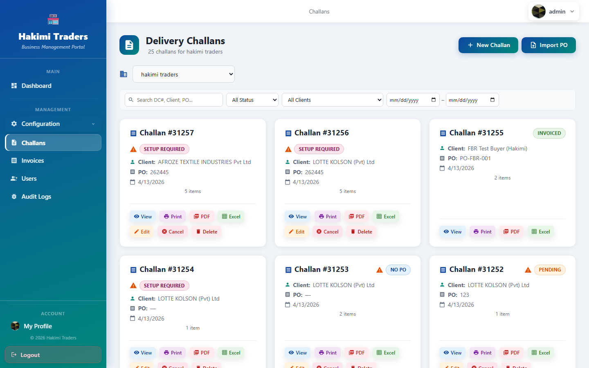

# PO Import Parser — Technical Guide

**Audience:** developer / operator onboarding a new Purchase Order format
**Last updated:** 2026-04-18
**Scope:** end-to-end flow for adding support for a new customer's PO layout
**without changing parsing behaviour for any existing format.**

> **TL;DR** — For every PO you upload, the backend first tries a **saved
> deterministic rule-set** for that layout. If no rule-set matches, it falls
> back to **Gemini LLM**, then to a generic **regex parser**. Onboarding a new
> format is a one-time "author the rule-set" step. From the second PDF onward,
> that format parses with zero LLM cost and zero variance.

---

## 1. Architecture at a glance

```
┌──────────────────────────────────────────────────────────────────┐
│                      POImportController                          │
│                                                                  │
│   PDF / pasted text ──► PdfPig text extract ──► rawText          │
│                                                                  │
│                                 │                                │
│                 ┌───────────────▼───────────────┐                │
│                 │     POFormatRegistry          │                │
│                 │     FindMatchAsync()          │                │
│                 │                               │                │
│                 │  (1) SHA-256 of sorted        │                │
│                 │      structural keywords      │                │
│                 │  (2) Fuzzy Jaccard ≥ 0.70     │                │
│                 └───────┬───────────────┬───────┘                │
│                         │               │                        │
│               EXACT MATCH             NO/FUZZY MATCH             │
│                         │               │                        │
│                         ▼               ▼                        │
│             RuleBasedPOParser    LlmPOParserService (Gemini)     │
│              (anchored-v1)              │                        │
│                         │               ▼                        │
│                         │        POParserService (regex)         │
│                         ▼               │                        │
│                     ParsedPODto  ◄──────┘                        │
└──────────────────────────────────────────────────────────────────┘
```

Three parsers, chosen in strict priority order:

| # | Parser | When used | LLM cost | Determinism |
|---|--------|-----------|----------|-------------|
| 1 | **RuleBasedPOParser** | Exact fingerprint match on a seeded/onboarded `POFormat` | **0** | 100% |
| 2 | **LlmPOParserService** | No exact match AND `Gemini:ApiKey` configured | 1 call | probabilistic |
| 3 | **POParserService** (regex) | LLM unavailable / rate-limited / returned nothing | 0 | heuristic |

Every new format you onboard moves one more PDF layout from **column 2** to
**column 1** — permanently, without touching any other format's behaviour.

---

## 2. Key concepts

### Fingerprint
`POFormatFingerprintService.Compute(rawText)` returns

- `Hash` — SHA-256 hex of the sorted pipe-joined keyword list
- `Signature` — the pipe-joined keyword list itself (human-readable)
- `Keywords` — the raw set (used for fuzzy Jaccard)

The keyword set is built from:
- **Labels**: capitalised 1–4 word phrases ending in `:` or `#`
  (matches `P.O. No:`, `Sales Tax #`, `Sr. No#`, etc.)
- **Table header tokens**: QTY / QUANTITY / UOM / RATE / AMOUNT / …

Value content (numbers, dates, currency) is intentionally excluded so that
two POs of the **same** layout with **different** values produce the **same**
hash. This is the whole reason the router can do an O(1) lookup.

### POFormat
A row in the `POFormats` table. Fields that matter:

| Column | Meaning |
|--------|---------|
| `Name` | Human label, e.g. `"Lotte Kolson PO v1"` |
| `CompanyId` | `NULL` = global baseline; otherwise tenant-scoped |
| `SignatureHash` | Exact-match key |
| `KeywordSignature` | Fuzzy-match key |
| `RuleSetJson` | The `anchored-v1` rules (see §4) |
| `CurrentVersion` | Auto-bumped on every rules change |
| `IsActive` | Deactivate without deleting |

Every rules change also appends a row to `POFormatVersions` — it's an
append-only audit log. You can always see what the rule-set was at any prior
version.

### POGoldenSample
A row in `POGoldenSamples` pairing a raw text dump of a PDF with the **verified
expected output**. These are the non-negotiable regression gate: every rules
update is replayed against every verified sample for that format AND checked
against samples of other formats (cross-format leakage check) before being
committed. A failing sample → `HTTP 409 Conflict` and the DB is untouched.

---

## 3. The onboarding workflow (the happy path)

You have a new customer PDF. The goal is: from the **second** PDF onward, it
parses via rules — no LLM, no guessing.

### Screenshot: PO Import entry point
`/challans → top right → Import PO` button.



### Step 1 — Upload the first PDF
Open `Challans → Import PO → Upload PDF → pick file → Parse & Preview`.

The first upload of an unseen layout will go through **Gemini**. Gemini's
output will populate the Review screen. The banner will **not** say "Matched
format" at this stage — that's your signal that this is a new layout.

### Step 2 — Correct anything Gemini got wrong
On the Review screen, edit the `PO Number`, `PO Date`, and each item's
`Description` / `Quantity` / `Unit` until the extraction is exactly what
you'd key in by hand. **This is the only moment where a human judges "correct".**

### Step 3 — Capture the keyword signature
In a separate terminal, fingerprint the raw text to get the hash (optional —
if you skip this, the server computes it for you at format-create time, but
inspecting the signature first helps you confirm you're about to create
a distinct format and not duplicate an existing one):

```bash
TOKEN=$(curl -s -X POST http://localhost:5134/api/auth/login \
  -H "Content-Type: application/json" \
  -d '{"username":"admin","password":"admin123"}' | jq -r .token)

curl -s -X POST http://localhost:5134/api/poformats/fingerprint-pdf \
  -H "Authorization: Bearer $TOKEN" \
  -F "file=@/path/to/new_customer_po.pdf" | jq
```

Response:
```json
{
  "hash": "d10c0810…",
  "signature": "amount|item|ltd ntn|order|qty|rate|…",
  "keywords": ["amount", "item", "ltd ntn", …],
  "matchedFormat": null,
  "matchSimilarity": null,
  "isExactMatch": false
}
```

`matchedFormat: null` confirms this is a brand-new layout.

### Step 4 — Author the rule-set
You now write a rule-set JSON that targets this layout. Start by copy-pasting
one of the four existing formats in `Data/POFormatSeeder.cs` that looks
structurally closest to your PDF:

- **`SoortyRules`** — multi-column table, description spans 2 columns + continuation lines
- **`LotteRules`** — clean column layout, integer item-code prefix, alpha prefix on PO# that gets stripped
- **`MekoRules`** — single regex row match, item-code + description + unit on one line

The rule-set schema (`engine: "anchored-v1"`) has two sections:

```jsonc
{
  "version": 1,
  "engine": "anchored-v1",

  "fields": {
    // Each field is { regex, group, flags, dateFormats? }
    "poNumber": {
      "regex": "P\\.\\s*O\\.\\s*#\\s+(?:[A-Za-z]+-)?(\\d[A-Za-z0-9\\-/]*)",
      "group": 1,
      "flags": "im"
    },
    "poDate": {
      "regex": "P\\.\\s*O\\.\\s*Date\\s+(\\d{1,2}[/\\-]\\d{1,2}[/\\-]\\d{2,4})",
      "group": 1,
      "flags": "im",
      "dateFormats": ["dd/MM/yyyy", "d/M/yyyy", "dd-MM-yyyy"]
    },
    "supplier": { "regex": "…", "group": 1, "flags": "im" }
  },

  "items": {
    // Pick ONE of two strategies:

    // (A) column-split — line is split by whitespace, columns referenced by index
    "strategy": "column-split",
    "split":     { "regex": "\\s{2,}" },
    "rowFilter": { "regex": "^\\d+\\s+\\d{5,}\\s+", "flags": "im" },
    "descColumn": 2,           // or "descColumns": [1,2] to join multiple
    "qtyColumn": 4,
    "unitColumn": 5,
    "stopRegex": { "regex": "^(Sub-Total|Total Amount|Remarks)", "flags": "im" },
    "continuationJoin": true,  // wrapped description lines get appended

    // (B) row-regex — one regex with named groups per line
    //   "strategy": "row-regex",
    //   "row": {
    //     "regex": "^\\d{6,}\\s+(?<desc>.+?)\\s+(?<unit>PC|PCS|…)\\s+(?<qty>\\d+)",
    //     "flags": "im"
    //   },
    //   "descGroup": "desc", "qtyGroup": "qty", "unitGroup": "unit"
  }
}
```

**Design rules of thumb:**
1. **Anchor on structural labels the PDF actually prints** (`P.O. No`, `Date`,
   etc.) — not on positional coordinates. PdfPig's text layout is stable
   across PDFs from the same template; labels are stabler still.
2. **Always use a `stopRegex` in `items`** — or the parser will slurp trailing
   "Total / Remarks / Payment Terms" boilerplate as items.
3. **`continuationJoin: true` is the default for a reason** — most corporate
   POs wrap long descriptions across 2-3 lines. Disable only if your rows
   are strictly single-line.
4. **Keep regexes greedy-safe** — put the most specific pattern first if
   you have alternatives. An over-eager PO# regex can grab "Reference" or
   "New" from the next column.

### Step 5 — Create the format (dry run first)
Test the rule-set without committing it, against an arbitrary raw text:

```bash
curl -s -X POST http://localhost:5134/api/poformats/0/test \
  -H "Authorization: Bearer $TOKEN" \
  -H "Content-Type: application/json" \
  -d '{
    "ruleSetJson": "{ … your rule-set … }",
    "additionalRawText": "<<full raw text from step 3>>"
  }' | jq
```

The response is a `RegressionReportDto` with the parsed output inline. If
it's wrong, iterate on the regex without ever touching the DB.

Once happy, **create the format**:

```bash
curl -s -X POST http://localhost:5134/api/poformats \
  -H "Authorization: Bearer $TOKEN" \
  -H "Content-Type: application/json" \
  -d '{
    "name": "Acme Corp PO v1",
    "companyId": null,
    "rawText": "<<full raw text from step 3>>",
    "ruleSetJson": "<<your rule-set JSON>>",
    "notes": "One-line supplier-to-hakimi PO, column-split layout."
  }' | jq .id
```

### Step 6 — Upload the **same** PDF a second time
This is the critical acceptance test. Re-upload → the Review screen must now
show a **green "Matched format: Acme Corp PO v1 (v1)"** banner.


*Example from production: Lotte Kolson PO v1 (v3) — the `POGI-` document-class
prefix is stripped, leaving only `001-2626-0000505`.*

### Step 7 — Lock it in as a verified sample
Click **Save as Verified Sample** on the green banner. This writes a row into
`POGoldenSamples` pairing that exact raw text with the (operator-verified)
expected output. From now on, **any future rule-set change for this format
will be refused if it doesn't keep this PDF parsing correctly.**

---

## 4. Protecting existing formats: the regression gate

This is the feature that lets you iterate on one format without fear of
breaking another. It runs in `POFormatRegistry.UpdateRulesAsync()`:

```
PUT /api/poformats/{id}/rules
     │
     ▼
┌─────────────────────────────────────────────────────┐
│   RegressionService.TestRuleSetAsync(id, newJson)   │
│                                                     │
│   for each POGoldenSample where POFormatId == id:   │
│     - re-parse raw text with candidate rule-set     │
│     - diff PO#, date, items vs expected             │
│     - if ANY diff → report.Passed = false           │
│                                                     │
│   if crossFormatCheck:                              │
│     for each POGoldenSample where POFormatId ≠ id:  │
│       - confirm candidate rule-set does NOT also    │
│         match that sample (leak detection)          │
│                                                     │
│   report.Passed? → commit + bump version            │
│   otherwise    → HTTP 409 + full diff, DB unchanged │
└─────────────────────────────────────────────────────┘
```

Bypass (emergency operator override only): `?force=true` on the same endpoint
skips the gate. Use only when the regression set itself is wrong (e.g., a
sample was captured with a bad expected value).

### Worked example — the Lotte `POGI-` fix we just shipped

The operator reported: "For Lotte, the PO# should be `001-2626-0000505`, not
`POGI-001-2626-0000505`." The `POGI-` prefix is Lotte's internal
document-class code that should not enter our bills/challans.

**1. Edit the rule-set** (`Data/POFormatSeeder.cs:235`):
```diff
- "poNumber": { "regex": "P\\.\\s*O\\.\\s*#\\s+([A-Za-z0-9/\\-]+)", … }
+ "poNumber": { "regex": "P\\.\\s*O\\.\\s*#\\s+(?:[A-Za-z]+-)?(\\d[A-Za-z0-9\\-/]*)", … }
```
The `(?:[A-Za-z]+-)?` non-capturing group eats the `POGI-` prefix;
group 1 then captures the digit-led tail.

**2. Update the golden sample's expected value** so the regression gate will
accept the rule change (`Data/POGoldenSampleSeeder.cs:87`):
```diff
- PoNumber = "POGI-001-2626-0000505",
+ PoNumber = "001-2626-0000505",
```

**3. Delete the existing stale sample** so the seeder recreates it:
```bash
curl -X DELETE http://localhost:5134/api/poformats/samples/2 \
  -H "Authorization: Bearer $TOKEN"
```

**4. Rebuild + restart.** On next boot the `POFormatSeeder` self-heals:
the hash matches but the rule-set differs → it overwrites `RuleSetJson`
in place and appends a `POFormatVersions` row with note
`"Re-seeded (baseline updated)"`. The `POGoldenSampleSeeder` sees no
sample for this format and re-seeds it with the **new** expected PO#.

**5. Verify no regression on the other three formats:**
```
Soorty 21620          21620              | 1 items | via: Soorty Enterprises PO v1 v2
Lotte  505            001-2626-0000505   | 1 items | via: Lotte Kolson PO v1 v3
Meko   Denim 262447   262447             | 1 items | via: Meko Denim/Fabrics PO v1 v6
```

Done. No other format was touched, no LLM was called for any of the three
matched PDFs, and the change is captured in both source (seeder) and the
append-only version history in the DB.

---

## 5. API reference (what the UI uses under the hood)

All endpoints require `Authorization: Bearer <token>` from `POST /api/auth/login`.

### Parser endpoints

| Method | Path | Purpose |
|--------|------|---------|
| `POST` | `/api/poimport/parse-pdf` | Multipart PDF upload → `ParsedPODto` |
| `POST` | `/api/poimport/parse-text` | JSON `{text}` → `ParsedPODto` |
| `POST` | `/api/poimport/ensure-lookups` | Auto-creates missing item descriptions + units before challan save |

The response `ParsedPODto` includes `matchedFormatId/Name/Version` when the
rule-based engine handled the parse — that's how the UI knows to show the
green banner.

### Format management

| Method | Path | Purpose |
|--------|------|---------|
| `GET` | `/api/poformats` | List formats (optionally `?companyId=`) |
| `GET` | `/api/poformats/{id}` | Get one format with its current rule-set |
| `GET` | `/api/poformats/{id}/versions` | Append-only version history |
| `POST` | `/api/poformats/fingerprint` | `{rawText, companyId}` → fingerprint + match hint |
| `POST` | `/api/poformats/fingerprint-pdf` | PDF upload → same as above |
| `POST` | `/api/poformats` | Create a new format |
| `PUT` | `/api/poformats/{id}/rules` | Update rule-set (gated by regression) |
| `PUT` | `/api/poformats/{id}/rules?force=true` | Bypass regression gate (dangerous) |
| `POST` | `/api/poformats/{id}/test` | Dry-run a candidate rule-set |
| `PUT` | `/api/poformats/{id}` | Update name / IsActive / notes |

### Golden samples

| Method | Path | Purpose |
|--------|------|---------|
| `GET` | `/api/poformats/{id}/samples` | List samples for a format |
| `POST` | `/api/poformats/{id}/samples` | Save a verified extraction (incl. PDF blob) |
| `DELETE` | `/api/poformats/samples/{sampleId}` | Remove a stale/bad sample |

---

## 6. Adding your own PDF to the `PdfDumper` tool (optional but recommended)

When authoring a rule-set, you want to work against the **exact** text PdfPig
will produce at runtime, not a hand-retyped approximation. The
`scripts/PdfDumper/` project is a self-contained CLI that reuses the same
line-reconstruction algorithm as `POParserService`.

```bash
cd scripts/PdfDumper
dotnet run -- ../../dumps \
  "/c/Users/you/Downloads/new_customer_po.pdf"
cat ../../dumps/01_new_customer_po.txt
```

Paste the resulting text into your rule-set's `rawText` field so the
fingerprint you store matches what production will compute.

---

## 7. Troubleshooting

| Symptom | Likely cause | Fix |
|---------|--------------|-----|
| PDF always falls through to LLM | Fingerprint hash mismatch between seeded sample and real PDF | Re-dump the PDF with `PdfDumper`, paste the **exact** text into the seeder sample, restart |
| Rule-based parse returns 0 items | `stopRegex` fires before the first row, or `rowFilter` doesn't match | Add `?` to test endpoint, inspect `Outcomes[].Diffs`; loosen `rowFilter`, narrow `stopRegex` |
| `HTTP 409` on rules update | Regression gate caught a sample diff | Read `report.Outcomes[].Diffs`; fix rule OR (if sample is wrong) delete sample, then retry |
| PO# has stray letters from adjacent line | Regex too greedy at the boundary | Anchor the capture more tightly; require `\d` or `[A-Z]{3,}` at the start of the token |
| `⚠ AI parser (Gemini) unavailable — quota hit` | Gemini free-tier daily limit reached | Wait 24h, or upgrade to paid key. **This warning is exactly why we want rule-based parsing for every known format.** |
| Format doesn't show on `/api/poformats` for companyId=X | Format is pinned to a different companyId | Either create it with `companyId: null` (global) or with the matching companyId |

---

## 8. Files & line numbers

| File | Responsibility |
|------|----------------|
| `Controllers/POImportController.cs` | 3-tier parse pipeline (rules → LLM → regex) |
| `Controllers/POFormatsController.cs` | Format CRUD + golden-sample CRUD + dry-run test |
| `Services/Implementations/POParserService.cs` | PdfPig text extraction + regex fallback parse |
| `Services/Implementations/LlmPOParserService.cs` | Gemini client + retry-on-429 + unit sanitiser |
| `Services/Implementations/RuleBasedPOParser.cs` | `anchored-v1` engine (column-split + row-regex) |
| `Services/Implementations/POFormatRegistry.cs` | Hash + fuzzy Jaccard routing; rules-update gate |
| `Services/Implementations/POFormatFingerprintService.cs` | Label + table-header → SHA-256 keyword hash |
| `Services/Implementations/RegressionService.cs` | Replay samples, cross-format leak check |
| `Data/POFormatSeeder.cs` | Baseline rule-sets for Soorty, Lotte, Meko × 2 |
| `Data/POGoldenSampleSeeder.cs` | Baseline golden samples that gate every rules change |
| `myapp-frontend/src/Components/POImportForm.jsx` | Upload/Paste → Review → Save-as-Sample UI |
| `scripts/PdfDumper/Program.cs` | CLI that matches the production PdfPig text extractor |

---

## 9. What "very less dependency on LLM" means in practice

After this guide's workflow is followed for N customer layouts, the runtime
cost profile becomes:

- **First PDF of a new layout**: 1 Gemini call (≈ 2-8s, $0.0001-0.001, probabilistic)
- **All subsequent PDFs of that layout**: 1 regex pass (<10ms, $0, deterministic)

With the four baseline formats already seeded (Soorty, Lotte, Meko Denim,
Meko Fabrics), every PDF we've seen so far parses via rules. The LLM stays
on standby strictly for layouts nobody has onboarded yet — exactly the
"minimal dependency" the operator asked for.
