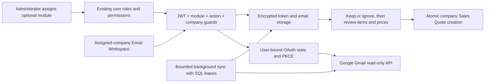

# Gmail enquiries and quotations

Email Workspace is a separate opt-in module. Each user authorizes their own Gmail account once and explicitly links it to companies they can access. A company assignment never grants access to another user's complete mailbox.

## Enable for existing users

Startup creates the built-in **Email Workspace** role without assigning it to existing users. Sales Edition, Complete Edition, Tenant Administrator and the general Administrator role exclude email permissions. The platform seed administrator retains its existing global permission bypass.

In **Users**, edit an existing user or administrator and add **Email Workspace** alongside their current roles. Retain only the company assignments they need. A tenant administrator can delegate this module only after receiving it themselves, and only to users within their management scope. Existing user-role checks prevent self-elevation and cross-tenant role assignment.

The navbar displays a separate **Email Workspace / Inbox & Connections** section only with module and inbox access. Unassigned users retain the existing Customize navigation. For a custom read-only role, select Module / Use and Inbox / View under the new Email Workspace permission section. Connections / Manage additionally allows Gmail authorization and linking. Removing Module / Use blocks API operations, OAuth completion and background sync even when action permissions remain. Quotation creation also requires the existing Sales Quote create permission.

## Workflow

1. Select an assigned company, open Email Workspace / Connections and authorize Gmail.
2. Initial sync imports received messages from the last 30 days, excluding spam, trash, drafts and sent mail. Later sync uses Gmail history. Older mail is outside this release.
3. Configure sender address, optional subject substring and customer rules separately per company. The owner's inbox remains private unless matching sender sharing is explicitly enabled or an email is kept.
4. Suggested highlights rule matches and enquiry subject words. Suggestions never create quotations. Keep shares an enquiry with permitted users of that company; Ignore hides it from the default list; Restore returns it to Unreviewed. These decisions do not change Gmail.
5. Prepare extracts supported HTML item tables using headings such as Description / ITEAM, Qty / Quantity and Unit / UOM. Embedded units are supported. Ambiguous quantities and merged rows require review. Only an unambiguous explicit customer rule can preselect a customer.
6. Review the customer, accessible division, descriptions, quantities, units and requirements. Enter prices and required brand/make details, confirm referenced specifications, then save a draft or explicitly confirm review and create the quotation.
7. The existing Sales Quote service assigns the company or division number and recomputes totals. Quote creation and source linking commit together. Repeated or concurrent conversion returns the existing quotation.

Attachments up to 10 MB can be downloaded while the mailbox is connected. Automatic PDF, spreadsheet, image and OCR extraction are outside this release. Unsupported layouts use the shared manual line editor. Email content is not sent to an AI provider; quotations are not automatically emailed or submitted to FBR.

## Architecture

OAuth state is one-use, expires after ten minutes and is bound to the initiating user and company. Credentials, email content and drafts use ASP.NET Data Protection. Sender and subject metadata remain searchable. Workers use separate scopes and a maximum of four concurrent mailbox syncs; SQL leases prevent duplicate work across hosts. Sync rechecks module, connection permission and company access. Cached kept enquiries remain company resources after unlinking, but unassigned users cannot read them.

## Google Cloud setup

Create a Google Cloud project, enable Gmail API, configure OAuth consent and add test accounts during testing. Create an OAuth client of type Web application and register the exact frontend callback, for example `http://localhost:<frontend-port>/email-workspace` locally or `https://<application-host>/email-workspace` for the intended installation. Include an installation base path where applicable. The backend's configured redirect URI must match it exactly. See [Google's web-server OAuth setup](https://developers.google.com/identity/protocols/oauth2/web-server).

Configure these values through local user secrets or the deployment secret store, never committed files:

- `Gmail:ClientId` / `Gmail__ClientId`
- `Gmail:ClientSecret` / `Gmail__ClientSecret`
- `Gmail:RedirectUri` / `Gmail__RedirectUri`
- `Gmail:SyncEnabled` / `Gmail__SyncEnabled` (set false for local-copy testing)

The implementation requests `openid email https://www.googleapis.com/auth/gmail.readonly`, offline access and user consent. Gmail read-only is a restricted scope. Review Google's verification and security-assessment requirements before public tenant rollout; see [Gmail scope requirements](https://developers.google.com/workspace/gmail/api/auth/scopes). No Google credentials are currently configured or committed.

Persist and protect the application's Data Protection key directory across deployments and share it appropriately across replicas. Losing the keys makes stored refresh tokens and content unreadable. Back up keys and encrypted data together with restricted access. Define retention and deletion policy for cached private mail before rollout; automatic retention is not implemented.

## Verification and release

See [verification evidence](GMAIL_EMAIL_WORKSPACE_VERIFICATION.md) and the [local company-isolation harness](../scripts/email-access-audit/README.md). Local-copy tests use synthetic mail and rollback transactions with no Google calls. Complete real consent, reconnect, email arrival and attachment-download tests after OAuth setup, including the example sender and three messages if within the import window. Do not claim those messages have been fetched yet.

This Customize port has its own additive migration and enforces division write access for drafts and conversion. Contact person is retained in quotation notes. Google setup and live acceptance remain required before rollout. Never merge the production product branches together.
