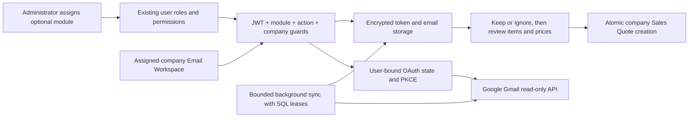

# Gmail enquiries and quotations

Email Workspace is a separate opt-in module. Each user authorizes their own Gmail account once and explicitly links it to companies they can access. A company assignment never grants access to another user's complete mailbox.

MCP users can also choose emails, supply explicit item prices and approve quotation creation
from ChatGPT. See [MCP setup and the email command workflow](MCP_AGENT_ACCESS.md#email-enquiries-from-chatgpt).
The ERP OAuth connection and Gmail OAuth connection are separate; ChatGPT never receives Gmail credentials.

## Enable for existing users

Startup creates the built-in **Email Workspace** role without assigning it to existing users. Sales Edition, Complete Edition, Tenant Administrator and the general Administrator role exclude email permissions. The platform seed administrator retains its existing global permission bypass.

In **Users**, edit an existing user or administrator and add **Email Workspace** alongside their current roles. Retain only the company assignments they need. A tenant administrator can delegate this module only after receiving it themselves, and only to users within their management scope. Existing user-role checks prevent self-elevation and cross-tenant role assignment.

The navbar displays a separate **Email Workspace / Inbox & Connections** section only with module and inbox access. Unassigned users retain the existing Trader navigation. For a custom read-only role, select Module / Use and Inbox / View under the new Email Workspace permission section. Connections / Manage additionally allows Gmail authorization and linking. Removing Module / Use blocks API operations, OAuth completion and background sync even when action permissions remain. Quotation creation also requires the existing Sales Quote create permission.

## Workflow

1. Select an assigned company, open Email Workspace / Connections and authorize Gmail.
2. Initial sync imports received messages from the last 30 days, excluding spam, trash, drafts and sent mail. Later sync uses Gmail history. Older mail is outside this release.
3. Configure sender address, optional subject substring and customer rules separately per company. The owner's inbox remains private unless matching sender sharing is explicitly enabled or an email is kept.
4. Suggested highlights rule matches and enquiry subject words. Suggestions never create quotations. Keep shares an enquiry with permitted users of that company; Ignore hides it from the default list; Restore returns it to Unreviewed. These decisions do not change Gmail.
5. Prepare extracts supported HTML item tables using headings such as Description / ITEAM, Qty / Quantity and Unit / UOM. Embedded units are supported. Ambiguous quantities and merged rows require review. Only an unambiguous explicit customer rule can preselect a customer.
6. Review the customer, descriptions, quantities, units and requirements. Enter prices and required brand/make details, confirm referenced specifications, then save a draft or explicitly confirm review and create the quotation.
7. The existing Sales Quote service assigns the company number and recomputes totals. Quote creation and source linking commit together. Repeated or concurrent conversion returns the existing quotation.

Attachments up to 10 MB can be downloaded and previewed while the mailbox is connected. PDF text layers, XLSX, XLS, CSV and UTF-8 TXT tables can supply draft items; images and scanned PDFs use the existing browser OCR engine and locally served English language data. Users explicitly append or replace items. Unsupported layouts use the shared manual line editor. Email content is not sent to an AI provider; quotations are not automatically emailed or submitted to FBR.

## Architecture

OAuth state is one-use, expires after ten minutes and is bound to the initiating user and company. Credentials, email content and drafts use ASP.NET Data Protection. Sender and subject metadata remain searchable. Workers use separate scopes and a maximum of four concurrent mailbox syncs; SQL leases prevent duplicate work across hosts. Sync rechecks module, connection permission and company access. Cached kept enquiries remain company resources after unlinking, but unassigned users cannot read them.

## Attachment and pricing assistance

After preparing an enquiry, select **Read items from attachment**. This first saves current edits, then shows extracted text, items and warnings without changing draft items. Choose **Append attachment items** or **Replace draft items with attachment** explicitly. No attachment price is imported. Applying items clears review, retains source descriptions and carries brand/drawing requirements into server-side conversion checks. OCR can confuse digits; always compare the result with the original. Current limits are 10 MB, 10 PDF/OCR pages, five workbook sheets, 5,000 rows per sheet and 40 columns. Workbook formulas are skipped, not evaluated; password-protected, unsupported or unreadable files require manual entry. Workbooks also have a 30 MB expanded-content limit. Table extraction requires recognizable description and quantity headings.

Choose the customer and select **Find catalogue matches and prices**. Suggestions come from the selected company's catalogue and recent quotations for that customer. Different numeric model/specification tokens are not fuzzily matched. Previously converted and reviewed enquiries can remember a customer's approved description mapping within that company. Users explicitly accept each description; quantity stays unchanged and its old price is cleared. Confirmed mappings are derived from encrypted converted drafts, so no additional schema migration is required.

Historical quotation rates require `salesquotes.list.view`; purchase costs require `purchasebills.list.view`. Customer and company scope are checked independently of these permissions, including before returning results. Only equal units are priced, brand-specific prices require the same brand text, and no unit/currency conversion is attempted. A price is applied only when the user chooses it. Cost is the latest recorded purchase unit price before tax and additional landed costs, not an inventory valuation; the displayed gross margin is an estimate. Queries use at most 2,000 recent quotation lines for the chosen customer, 2,000 recent company purchase lines, 2,000 company catalogue entries and 200 converted enquiry mappings. Older unmatched history requires manual lookup. No customer selection means no customer quotation history.

## Real-tenant acceptance session — Saturday, 2026-10-10

1. Complete the Google Cloud setup below, register the exact callback URL and add the intended mailbox as a test user when the consent app is in Testing. Store the client secret outside tracked files. Confirm the API and frontend use the intended approved test environment before creating quotations.
2. Assign Email Workspace and the intended action permissions to the existing tenant user. Assign only their companies. Grant Sales Quote create for conversion, quotation view for historical rates and optional purchase view for cost visibility.
3. Have the mailbox owner perform consent. Test cancellation, reconnect after revocation and synchronization after signing out/in. Record results without copying tokens or personal mail into the public repository.
4. Locate the three example messages if they fall within the initial 30-day import window. Confirm sender rules, customer selection and forwarding behavior. Keep one, ignore one, restore it and verify that these choices do not change Gmail.
5. Review an HTML enquiry, a PDF, an Excel sheet and a scanned image if available. Compare every item, quantity, unit, brand and drawing requirement. Verify preview versus append/replace, manual correction and missing/ambiguous quantity warnings.
6. Check a known customer's last quotation and purchase cost against the original records. Change customer or company and verify that old suggestions disappear. A user without purchase-view access must never receive costs.
7. Enter or explicitly accept prices, confirm review and create a quotation. Verify its company, customer, number, quantities, totals and original email link. Retry conversion and confirm it returns the same quotation.
8. Test a second user with a different company assignment. Verify private mail stays private, kept enquiries and explicit sender sharing stay within the selected company, and revoking company or module access immediately blocks inbox, previews, suggestions and OAuth.
9. Link a permitted mailbox to a second assigned company and test concurrent synchronization. Confirm there is one connection authorization per user/account with explicit company links and no cross-company customer or price suggestions.

Real Google consent and real-tenant mail acceptance are pending until this session is executed. These instructions are a checklist, not a scheduled job or a claim that the mailbox has been accessed. Later additions such as reply sending, follow-up reminders, enquiry assignment, duplicate/revision management and company approval policies are outside this increment.
## Google Cloud setup

For the Saturday MCP acceptance, also connect ChatGPT as the intended ERP user, choose only
their assigned companies and explicitly enable email-selection and quotation-write scopes.
Run Keep/Ignore and a priced quotation through preview and approval; confirm totals and the
source link in the application. Try an unassigned company, revoke module/company access after
preparation, and verify commit is refused. This live connector acceptance remains pending.

Create a Google Cloud project, enable Gmail API, configure OAuth consent and add test accounts during testing. Create an OAuth client of type Web application and register the exact frontend callback, for example `http://localhost:<frontend-port>/email-workspace` locally or `https://<application-host>/email-workspace` for the intended installation. Include an installation base path where applicable. The backend's configured redirect URI must match it exactly. See [Google's web-server OAuth setup](https://developers.google.com/identity/protocols/oauth2/web-server).

Configure these values through local user secrets or the deployment secret store, never committed files:

- `Gmail:ClientId` / `Gmail__ClientId`
- `Gmail:ClientSecret` / `Gmail__ClientSecret`
- `Gmail:RedirectUri` / `Gmail__RedirectUri`
- `Gmail:SyncEnabled` / `Gmail__SyncEnabled` (set false for local-copy testing)

The implementation requests `openid email https://www.googleapis.com/auth/gmail.readonly`, offline access and user consent. Gmail read-only is a restricted scope. Review Google's verification and security-assessment requirements before public tenant rollout; see [Gmail scope requirements](https://developers.google.com/workspace/gmail/api/auth/scopes). No Google credentials are currently configured or committed.

Persist and protect the application's Data Protection key directory across deployments and share it appropriately across replicas. Losing the keys makes stored refresh tokens and content unreadable. Back up keys and encrypted data together with restricted access. Define retention and deletion policy for cached private mail before rollout; automatic retention is not implemented.

## Verification and release

See [verification evidence](GMAIL_EMAIL_WORKSPACE_VERIFICATION.md) and the [local company-isolation harness](../scripts/email-access-audit/README.md). Local-copy tests use synthetic mail and rollback transactions with no Google calls. Complete real consent, reconnect, email arrival and attachment-download tests after OAuth setup, including the example sender and three messages if within the import window. Do not claim those messages have been fetched yet.

Work remains on the separate Trader feature branch. Obtain fresh approval before commit, push, merge or deployment. Port to Customize deliberately with its own migration and verification; never merge the production product branches together.
